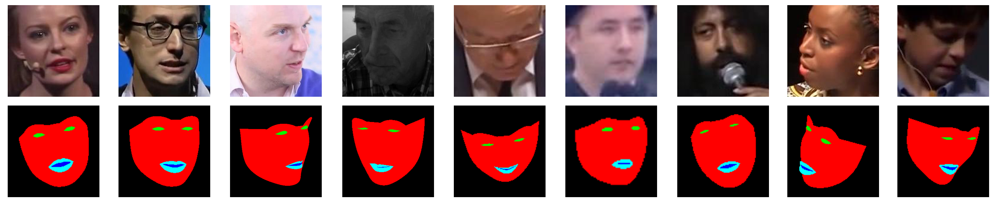

# 300VW-Mask Dataset

The repository provides the download of the 300VW-Mask dataset utilised in the following papers:
```
@article{wang2019face,
  title={Face mask extraction in video sequence},
  author={Wang, Yujiang and Luo, Bingnan and Shen, Jie and Pantic, Maja},
  journal={International Journal of Computer Vision},
  volume={127},
  number={6},
  pages={625--641},
  year={2019},
  publisher={Springer}
}
```

```
@inproceedings{wang2020dynamic,
  title={Dynamic face video segmentation via reinforcement learning},
  author={Wang, Yujiang and Dong, Mingzhi and Shen, Jie and Wu, Yang and Cheng, Shiyang and Pantic, Maja},
  booktitle={Proceedings of the IEEE/CVF Conference on Computer Vision and Pattern Recognition},
  pages={6959--6969},
  year={2020}
}
```

The 300VW-Mask dataset is an extension of the 300 Videos in the Wild ([300VW Dataset](https://ibug.doc.ic.ac.uk/resources/300-VW/)) [1] where pixel-wise annotations (face mask) are provided for each cropped facial image. See [2] for how this is done. See examples of cropped faces and mask labels below.



This dataset only contains the pixel-wise mask labels for pre-cropped facial images of 300VW. Please visit the original [300VW Dataset](https://ibug.doc.ic.ac.uk/resources/300-VW/) if you need other information like landmark annotations or original frame images.

## Download Link

The 300VW-Mask dataset can be downloaded [here](https://drive.google.com/file/d/1ZbCDFs-rYKRIOPpnLPV1eZ-CTwRTF4In/view?usp=sharing) (Google Drive)
or [here](https://www.dropbox.com/s/gvwjg6dnqh13npf/300VW-Mask-Dataset.zip?dl=0) (Dropbox).

## File Structure
Unzip the downloaded file and you will see the following file structure:
```
..
├── 300VW-Mask-Dataset
│   ├── images_orig
│       └── 001_000001.jpg
│           ...
│   ├── labels_orig
│       └── 001_000001.png
│           ...
│   ├── data_splits
│       ├── split_1
│       └── split_2
│   └── README.md
```

The cropped facial images and the corresponding mask labels reside under `images_orig` and `labels_orig` folders, respectively. 

The cropped facial image named "xxx_yyyyyy.jpg" stands for the yyyyyy-th frame of the "xxx" video in the original 300VW dataset. Please be aware that "000001" is the starting frame of the video, not "000000". 

The mask labels are named identically except that it ends with "png".

## Data Splits

We provide the data splits used in [2] under `data_splits/split_1`, where `train_per10.txt`/`val_per10.txt`/`test_per10.txt` corresponds to the train/validation/test sets of the 10% 1-s sequences (see [2] for more details). 

The data splits used in [3] are provided in `data_splits/split_2` folder, where `A.txt`/`B.txt`/`C.txt` corresponds to the A/B/C sets used in [3].

Each line in the data split file, e.g. "/images_orig/xxx_yyyyyy.jpg /labels_orig/xxx_yyyyyy.png" indicates the paths of the cropped facial image and the mask label for the yyyyyy-th frame of the "xxx" video in 300VW.

Note that we have excluded certain frames with inaccurate landmark annotations from the data splits. See `ReadMe.txt` and `extra.zip` of the original [300VW Dataset](https://ibug.doc.ic.ac.uk/resources/300-VW/) for details.

## Generate 300VW-Mask

If you would like to generate 300VW-Mask from the original 300VW using different settings, e.g. with larger or smaller cropping margins, you can use the Matlab scripts under `./processing_scripts` to do so.

The script `./processing_scripts/do_segmentation.m` will generate the face mask for a frame with 68 landmark annotations.

The script `./processing_scripts/crop_face_and_seg.m` will crop the frame image and the generated mask label with a certain margin.

Please consider cite our works [2][3] if you find this dataset useful.

## Reference

1.  **The first facial landmark tracking in-the-wild challenge: Benchmark and results**<br />
    Jie Shen, Stefanos Zafeiriou, Grigoris G. Chrysos, Jean Kossaifi, Georgios Tzimiropoulos, Maja Pantic. <br />
    [[link]](https://openaccess.thecvf.com/content_iccv_2015_workshops/w25/html/Shen_The_First_Facial_ICCV_2015_paper.html). 
    Proceedings of the IEEE international conference on computer vision workshops. 2015.
    
2. **Face mask extraction in video sequence**<br />
    Yujiang Wang, Bingnan Luo, Jie Shen, Maja Pantic. <br />
    [[link]](https://link.springer.com/article/10.1007/s11263-018-1130-2). 
    International Journal of Computer Vision. 2019.
    
3. **Dynamic face video segmentation via reinforcement learning**<br />
    Yujiang Wang, Mingzhi Dong, Jie Shen, Yang Wu, Shiyang Cheng, Maja Pantic. <br />
    [[link]](https://openaccess.thecvf.com/content_CVPR_2020/html/Wang_Dynamic_Face_Video_Segmentation_via_Reinforcement_Learning_CVPR_2020_paper.html). 
    Proceedings of the IEEE/CVF Conference on Computer Vision and Pattern Recognition. 2020.
